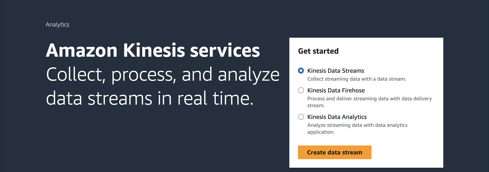
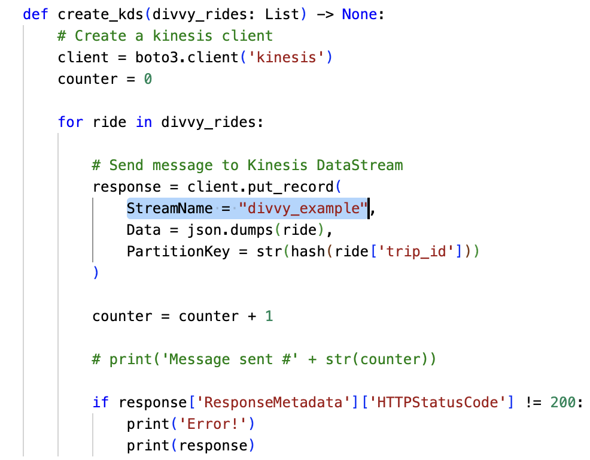

# Creating a Kinesis Data Stream

# Step 1. Setting up AWS Environment Variable

1. Run 'pip install boto3' if you have not already
2. Install aws CLI - https://docs.aws.amazon.com/cli/latest/userguide/install-cliv2.html
3. Run 'aws configure'
```
aws configure sso --profile <profile_name>
```
4. Login to AWS Profile
```
aws sso login --profile <profile_name>
```

5. Setting up environment variable
```
export AWS_PROFILE=<profile_name>
```

# Step 2. Create Kinesis Data Stream on AWS Console

1. Search Kinesis in AWS Console
2. Create Data Stream with Kinesis Data Stream option selected

3. Keep note of the name chosen for the data stream.

# Step 3. Update in .py script

1. Set the right name of stream as in AWS Console


# Step4. Run DivvyBikesKDS.py script
